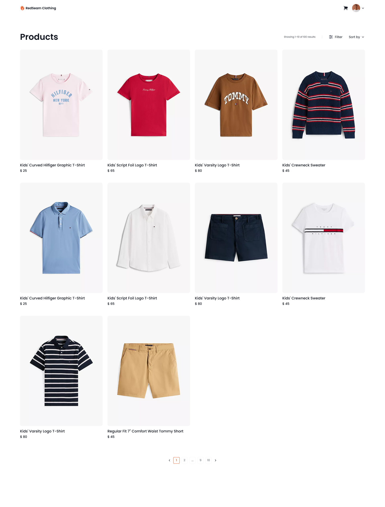

#  RedSeam

RedSeam is a modern **clothing e-commerce website** built with **React, Vite, TypeScript, and TailwindCSS**. It allows users to browse products, view details, manage a shopping cart, and complete purchases with a streamlined checkout process.

---

## 🚀 Features

- **Product Listings:** Browse clothes with dynamic filtering and sorting.
- **Product Details Page:** View detailed information and images for each item.
- **Cart Functionality:** Add, update, or remove items from the cart.
- **Checkout Process:** Complete purchases with ease.
- **Authentication:** Login and register to manage personal data and orders.

---

## 🛠️ Tech Stack

[](https://reactjs.org)
[](https://vitejs.dev/)
[](https://www.typescriptlang.org/)
[](https://tailwindcss.com/)
[](https://reactrouter.com/)
[](https://axios-http.com/)

---

## 📁 Folder Structure

```yaml
src/
├── api/ # API services & hooks
│ ├── hooks/
│ ├── services/
│ └── api.ts
├── components/ # Reusable UI components
├── context/ # React Context Providers
├── hooks/ # Custom hooks
├── interfaces/ # TypeScript types
├── pages/ # Page components
├── schemas/ # Validation schemas
├── utils/ # Utility functions
├── App.tsx
├── main.tsx
└── Other files
```

> Note: Components are organized by features and relations for scalability.

---

## 💻 Getting Started

Clone the repository and install dependencies:

```bash
git clone https://github.com/Luka-khokhashvili/RedSeam.git
cd RedSeam
npm install
```

Run in Development Mode

```bash
npm run dev
```

The app will be available at http://localhost:5173 by default.

Build for Production

```bash
npm run build
npm run preview
```

## 📷 Screenshots



## Links

[](https://redseam-ten.vercel.app)
[](https://github.com/Luka-khokhashvili/RedSeam.git)

## Get in Touch

[](https://www.linkedin.com/in/luka-khokhashvili-8179b7285/)
[](mailto:khokhashvililuka@gmail.com)
[](https://portfolio-three-sigma-59.vercel.app/)

## ⚖️ License

**Licensed under:** [MIT](https://opensource.org/licenses/MIT)

Made by [**Luka khokhashvili**](https://github.com/Luka-khokhashvili). All rights reserved.
